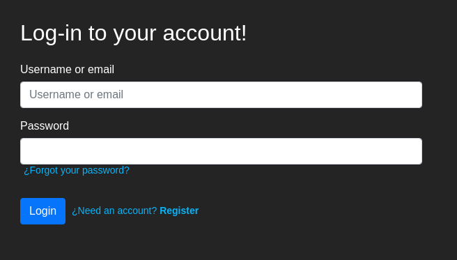
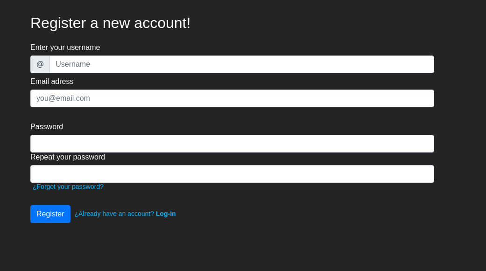
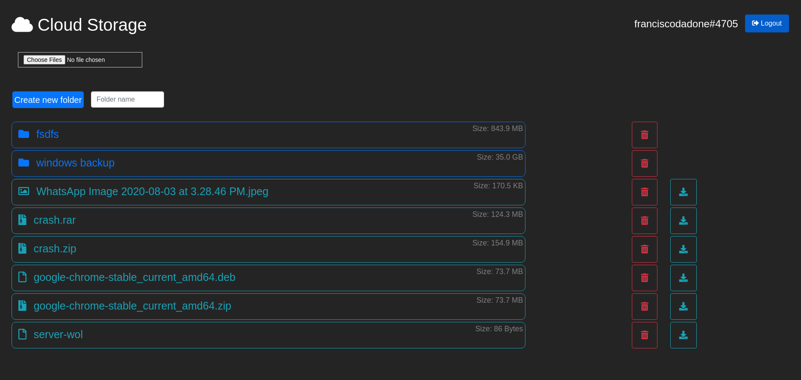
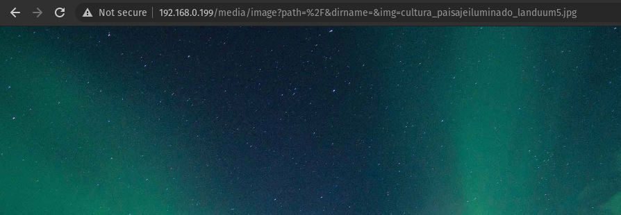
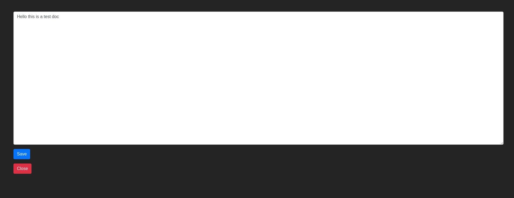

<!-- PROJECT LOGO -->
<br />
<p align="center">
  <a href="https://github.com/FranciscoDadone/FileServer">
    
</a>

  <h3 align="center">File Server</h3>

  <p align="center">
  A node.js server to allocate files!
<br />
    <a href="https://github.com/FranciscoDadone/FileServer"><strong>Explore the docs »</strong></a>
    <br />
  </p>
</p>


<!-- TABLE OF CONTENTS -->
<details open="open">
  <summary>Table of Contents</summary>
  <ol>
    <li>
      <a href="#about-the-project">About The Project</a>
      <ul>
        <li><a href="#built-with">Built With</a></li>
      </ul>
    </li>
    <li>
      <a href="#getting-started">Getting Started</a>
      <ul>
        <li><a href="#prerequisites">Prerequisites</a></li>
        <li><a href="#installation">Installation</a></li>
      </ul>
    </li>
    <li><a href="#usage">Usage</a></li>
    <li><a href="#contact">Contact</a></li>
  </ol>
</details>


<!-- ABOUT THE PROJECT -->
## About The Project: Features

Login page



Register page



Home page



Click a image to display its content



Click a text document to view and edit it




<br />
<br />
<br />

* I've created this project for fun, and it's a nodeJS file server that you can access it via a webpage, it has a login and manages users accounts and the data that users could store in the cloud. This is basically a onedrive or google drive clone if you will.

### Built With

* [NodeJS](https://nodejs.org)
* [Express](https://expressjs.com)
* [MongoDB](https://account.mongodb.com/account/login?n=%2Fv2%2F5e8f71fa634bbb370511fc1f&nextHash=%23clusters%2Fconnect%3FclusterId%3DCluster0)
* [Bootstrap](https://getbootstrap.com)
* [JQuery](https://jquery.com)


<!-- GETTING STARTED -->
## Getting Started

### Prerequisites

* npm
  ```sh
  npm install npm@latest -g
  ```
* Mongo database: You can create your free cluster to get started here <a href="https://account.mongodb.com/account/login">here</a> or install a local database.
* pm2
  ```sh
  npm install pm2 -g
  ```

### Installation

1. Clone the repo.
   ```sh
   git clone https://github.com/FranciscoDadone/FileServer
   ```
2. Install NPM packages
   ```sh
   npm install
   ```
3. Enter your MONGO_URI2 in `config/keys.js` or if you'r using PM2 in `ecosystem.config.js`.
   ```JS
   const MONGO_URI2 = 'ENTER YOUR MongoDB URI';
   ```


<!-- USAGE EXAMPLES -->
## Usage

* If you want to change the port (default: 3000) you can edit the ´ecosystem.config.js´ file and change the port to whatever you want or if you'r not using pm2, you can go to ´bin/www´ and change ´var port = normalizePort(process.env.PORT || '3000');´ and change it there.

To start the server use
  ```sh
   npm run start
  ```
or this if you're using pm2
  ```
  pm2 start
  ```


<!-- CONTRIBUTING -->
## Contributing

Contributions are what make the open source community such an amazing place to be learn, inspire, and create. Any contributions you make are **greatly appreciated**.

1. Fork the Project
2. Create your Feature Branch (`git checkout -b feature/AmazingFeature`)
3. Commit your Changes (`git commit -m 'Add some AmazingFeature'`)
4. Push to the Branch (`git push origin feature/AmazingFeature`)
5. Open a Pull Request


<!-- CONTACT -->
## Contact

Francisco Dadone - [@FranDadone](https://twitter.com/FranDadone) - dadonefrancisco@hotmail.com.ar

Project Link: [https://github.com/FranciscoDadone/FileServer](https://github.com/FranciscoDadone/FileServer)
